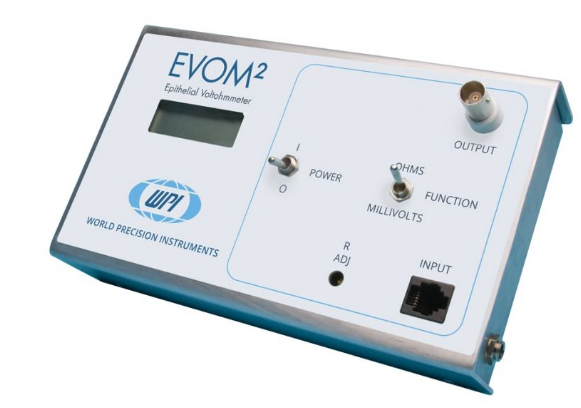

# Accessories
This catagory encompasses all things outside of electronics for the Flexi-TEER device. The primary device accessories desired are:

1. Currently, models for a cell that holds transwells and electrodes in place and a platform that holds 12 of these cells are created in tinkercad. This is not a good platform and both of these need recreated in FreeCAD. If you contact me, I will give you access to the tinkercad account which will allow you to get the information needed to recreate it.  

* Case for electronics. The initial goal is to create a case that has a LCD screen and a RJ45 jack for the electrode in it. Inspiration can be taken from the World Instrumentation's EVOM meter. 

